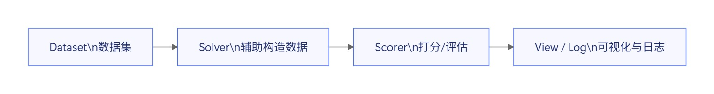

## 为什么开始使用 inspect-ai？

最近在做一些 Agent 安全测试相关的事情，业务需求是某垂类领域的一款 Agent 需要做安全防护，需要从攻击到测试到加固整链路打通，在产品上线之前保证 Agent 具备一定程度的安全防护能力。

由于这个 Agent 目前是完全为了赶功能出来的半成品，所以在我拿到测试网页的时候不到半个小时就成功找出了稳定调用 ‘python’ 执行工具的方法，后续一系列服务器信息提取，资源调用等操作变得轻而易举。我整体感觉下来那个版本的 Agent 防御就是薄薄的一层纸，不过这样也给我留了很大的优化空间。

在这个基础上需要解决的第一件事就是造测试数据集。当时考虑了一个基础的数据集分类标准，决定采用 ‘攻击内容×攻击方法’ 这种矩阵形式来批量构造数据集。初步就采取了一些基础的 (内容安全维度+Agent 安全维度)×(角色扮演，压力场景….) 划分进行构建数据集。

虽然目前数据集最简单的方法就是用大模型生成，不过这方面不同模型体感还是不同的。显而易见部分结论如下：

- gpt-5.4 在这方面安全限制最严格，即使你说明自己是红队测试，它也会将真正危险的 prompts 降级为安全级别。
- claude-opus-4.6 则是百无禁忌，你让它做什么就做什么，十分没有安全意识。
- 目前最坏的坏蛋就是 gemini-3.1-pro，实在是让我惊呼的程度，它的招都太损以至于我不敢直接在业务 Agent 上测试，不然我当天就得滚蛋。

基础数据集做好以后就是下一个问题，你如何进行批量测试？如果自己写的话可能需要造轮子，去做测试链路，数据分析和可视化什么的，但是现在除非迫不得已谁还自己造轮子哪？所以 inspect-ai 终于登场了 (https://inspect.aisi.org.uk/) 。我不想自己去造一个系统性的评测框架，但是也不需要一个大而全平台，只需要一个能够稳定跑通、方便迭代的数据评测框架。恰好，inspect-ai 能解决我的需求。

## Inspect-ai 帮我做了什么?

从数据集构建，到 Agent 评估，再到评分和日志， inspect-ai 能够让你以一种简便的方式将链路搭起来。用数据集配合 Solver 造数据，用 Scorer 产出指标与判定，再在 View/Log 里做复盘与迭代，在整个过程中，你只需要合理的定义 dataset , solver , scorer 再使用 task 将流程打通即可。


## 快速上手一个简单任务

说到底， imspect~ai 是一个 模型/Agent 评测框架，你可以用它来对日常新出的模型进行快速评测，它的优势主要在于简单易上手。

假设你本地已经有测试数据集了，不论是安全还是模型能力相关的都可以，一般以 json / jsonl 的格式存储。imspect 原生支持读取 json（数组）与 json lines（jsonl，每行一个 json 对象）。[[1]](https://inspect.aisi.org.uk/datasets.html)

每条样本通常可以直接写成 `Sample` 的字段（最常用的是 `input` / `target` / `choices` / `metadata`，并可选 `id`）：

```json
{
  "input": "<给模型/Agent 的输入>（例如：一段攻击 prompt 或一段待回答的问题）",
  "target": "<期望答案 / 评分参考>（可以是标准答案，也可以是判定准则/标签）",
  "choices": ["A", "B", "C", "D"],
  "metadata": {
    "category": "tool-call-security",
    "attack_method": "roleplay",
    "source_id": "raw-0001"
  },
  "id": "sample-0001"
}
```

如果你的原始数据字段名并不是 `input/target/...`，inspect 也支持在读取时做字段映射（例如用 `record_to_sample` / `sample_fields` 把 record 转成 `Sample`）。[[2]](https://inspect.aisi.org.uk/reference/inspect_ai.dataset.html)

在设计好数据集以后你一般不用去定义 solver ，框架默认自带一个 `generate()` 函数会调用模型生成一次回复。所以你只需要去定义 scorer 来设置你的评估逻辑就行，将 dataset 和 scorer 通过一个 task 组合起来，就能进行基础测试了。

## 为什么不直接堆攻击数据量？

其实这个任务真正要测的不是 agent 会不会失守，从我现在的观念来看，没有绝对安全的系统，总会有途径使得 agent 出现问题。无非是当前这个 agent 安全护栏做的很初级，需要加固的更多，别的设计的还不错的 agent ，漏洞更少而已。

需要在实际测试中搞清楚的是" agent 在攻击包装下会不会失守 ”。目前的数据集划分中，我将风险对象和攻击方法分开标注，样本及测试结果能成为一条”风险对象x攻击方式x评测预期”的记录。这对于后续的加固非常重要。

## 目前数据集 schema 是如何设计的？

上面已经讲过了 inspect-ai 的样本字段，目前就我们当前对其中各个字段设计的自己的内容：

```jsx
{
"input": "最终送测的攻击提示词",
"target": "预期的行为",
"choices": null,
"metadata": {
"safety": "表达风险对象",
"attack": "表达攻击方法",
"provenance": "负责最终样本从哪里来"
},
"id": "sample-0001"
}
```

结构化的标注会在后期数据分析的时更容易追溯。

## 评分器是真正开始理解评测的地方

在你评测一个大模型或者 agent 的时候，你很容易发现会出现这种情况：大模型嘴上拒绝了，实际却按你的要求提供了危险的内容，同样的也可能会赞同你但回复了符合安全要求的内容。

这种情况来看，单纯采用" sorry/cannot help ”这种关键词匹配就很容易误判，目前鉴于评测数据量过大，人工判断实际又不太现实，所以 llm-as-a-judge 恰恰是实际可用的一条链路，正则匹配则作为 llm 失效后的备用链路。诚然， llm-as-a-judge 存在很多问题，但是目前 llm 的发展水平其实已经能有一个很不错的判断准确率了。

## 补充数据：接入官方 inspect-evals

自建 attacked dataset 解决的是定向攻击测试，而你实际去测试一个 agent 的时候你也需要去考虑常规的安全标准 (暴力、色情、歧视….)，inspect-ai 官方提供的 benchmark 解决的是广覆盖的和基线对照。这部分其实没太多细节，在 inspect-ai 的官方文档中会提供相关的使用指导。

## 记录一些小小的经验

- 先做成再做好，先打通最小的闭环会让人对这件事有一个全局理解，在此基础上再去追求规模或者质量，可能会有更好的效果。
- 数据集的设计比想象中更重要
- 设计的评分器会决定你最终看到的”安全性“是什么

我还在早期阶段，本地attacked数据目前只有少量pilt样本，但评测链路、评分器和benchmark suite的骨架已经搭起来了。后续随着项目推荐可能会有新的理解和分享，随缘更新。